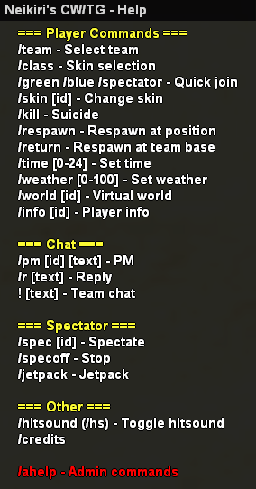
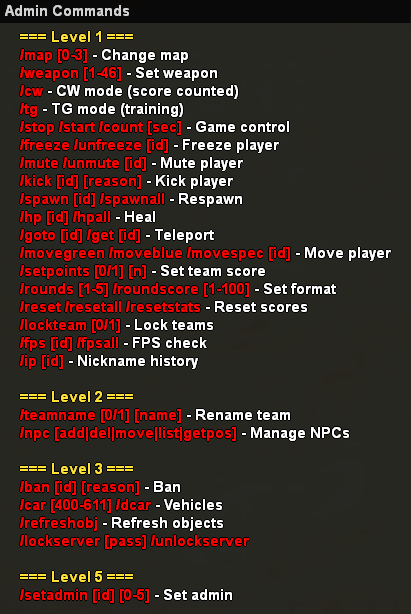

<p align="center">
    
</p>

<h1 align="center">Neikiri's SA-MP CW/TG Gamemode</h1>

<p align="center">
    <a href="https://github.com/neikiri/neiki-cwtg-samp/releases">
        
    </a>
    
    
    
    <br>
    
    
</p>

<p align="center">
    <b>A fast-paced SA-MP clan war and team game mode with team-based combat, score tracking, map rotation, and admin controls.</b>
    <br>
    <i>Built for CW/TG gameplay with skins, scoreboard HUD, round flow, spectator support, and SQLite-based admin, user and ban management.</i>
</p>

<p align="center">
    
    
    
</p>

---

<p align="center">
    
    
</p>

---

## ✨ Overview

This project is a compact and customizable SA-MP gamemode designed for CW/TG gameplay, built around two teams, round-based scoring, and a streamlined HUD. The mode includes skin selection, spectating, team chat, weather/time control, spawn logic, anti-cheat checks, and a full admin suite for server management.

The gamemode is written in Pawn and uses SQLite database files for player admin access, user tracking, and bans. On the first launch of the server, the script automatically creates files such as `admins.db`, `users.db`, and `bans.db` in the server's `scriptfiles` folder.

The gameplay loop is simple:

- players join a team
- each map contains spawn positions and controlled score conditions
- rounds are won by reaching the configured target score
- the match ends when a team wins the set number of rounds
- admins can manage teams, players, maps, scores, and permissions from the server

## ⚙️ Features

- Two-team CW/TG system with Green and Blue factions
- Round-based score system with configurable score and round limits
- Team kill detection and scoreboard updates
- Skin selection and banned speed-skin prevention
- Spectator mode and quick team join commands
- Server password lock support
- Weather, time, and virtual world controls
- Custom map list and team spawn points
- Admin system with multiple permission levels from 0 to 5
- SQLite-backed admin, user, and ban databases
- NPC support and basic player HUD systems

## 🗺️ Gameplay Structure

The mode is built around a match system that includes:

- team assignment and spawning
- weapon selection per match
- round timer progression and score logic
- match result display and end-of-round summary
- scoreboard text draws for both teams
- spectator handling for reconnects and team transitions

The server uses pre-defined maps and spawn layouts for multiple arenas, including examples like Airport, Hangars, Baseball, and Driving School. The map selection and team names are configurable directly in the source code.

## 🧪 Installation

### Requirements

- SA-MP server with Pawn support
- Pawn compiler or a compiled `.amx` script
- Access to the server root directory
- Optional: RCON access for admin management and runtime commands

### Steps

1. Download or clone this repository.
2. Place the gamemode file in your server's `gamemodes` folder.
3. If using the compiled version, ensure the `.amx` file is present alongside the source.
4. Add the gamemode to your `server.cfg`:

```cfg
gamemode0 neiki-cwtg
```

5. Start the server.
6. On the first startup, the mode will automatically create the database files in the `scriptfiles` directory:

- `admins.db`
- `users.db`
- `bans.db`

## 🛠️ Server Setup

The script is designed for a standard SA-MP environment and does not require any external framework. The main configuration values are defined near the top of the Pawn source file, including:

- team names
- default rounds and round score
- default weapon
- map count and arena list
- server password lock state

If you want to customize the gamemode, the best place to start is the top of `gamemodes/neiki-cwtg.pwn` where constants and gameplay defaults are defined.

## 🔐 Administration

Admin permissions are stored in the SQLite `admins.db` database and linked to player IP addresses. A player can be assigned an admin level from `0` to `5`.

The recommended way to grant admin rights is:

1. Connect to the server via RCON.
2. Run the command:

```text
/setadmin (id) (admin level)
```

Example:

```text
/setadmin 3 5
```

This assigns admin level `5` to player ID `3`.

Admin levels are used to unlock specific commands and permissions. The script exposes admin help via `/ahelp`, and higher-ranked admins can use functions like:

- map and weapon control
- round setup and score reset
- kicks, bans, team renames
- server lock management
- setting other admins

## 🧾 Commands

This gamemode includes a full in-game command system. The following list reflects the actual commands implemented in the Pawn source.

### Player commands

- `/help` — displays player help
- `/ahelp` — displays admin help if admin level is active
- `/team` — open the team selection dialog
- `/class` — open class selection screen
- `/green` — quick join Green team
- `/blue` — quick join Blue team
- `/spectator` — join spectator mode
- `/spec [id]` — spectate a player
- `/specoff` — stop spectating
- `/jetpack` — use jetpack while spectating
- `/skin [id]` — change skin
- `/weather [0-100]` — set weather
- `/time [0-24]` — set time
- `/world [id]` — set virtual world
- `/getworld` — show current world ID
- `/kill` — suicide
- `/respawn` — respawn at current position
- `/return` — respawn at team spawn
- `/pm [id] [text]` — private message
- `/r [text]` — reply to last PM
- `/info [id]` — show player info
- `/stats` — alias for `/info`
- `/hitsound` or `/hs` — toggle hit sound
- `/credits` — display credits
- `! [text]` — team chat

### Account / login commands

- `/register [password]` — register a password-protected account
- `/login [password]` — log in with the saved password

### Admin commands (Level 1+)

- `/map [0-3]` or `/dm` — change map
- `/weapon [1-46]` — set weapon
- `/cw` — enable CW mode (score counted)
- `/tg` — enable TG mode (training)
- `/stop` — freeze all players
- `/start` — resume gameplay
- `/count [1-30]` — start countdown
- `/freeze [id]` — freeze a player
- `/unfreeze [id]` — unfreeze a player
- `/mute [id]` — mute a player
- `/unmute [id]` — unmute a player
- `/kick [id] [reason]` — kick a player
- `/spawn [id]` — respawn a target player
- `/spawnall` — respawn all players
- `/hp [id]` — heal a player
- `/hpall` — heal all players
- `/goto [id]` — teleport to a player
- `/get [id]` — teleport a player to you
- `/movegreen [id]` — move player to Green team
- `/moveblue [id]` — move player to Blue team
- `/movespec [id]` — move player to spectator
- `/setpoints [0/1] [n]` — set team score
- `/pointsgreen [0-100]` — set Green team score
- `/pointsblue [0-100]` — set Blue team score
- `/rounds [1-5]` — set match round count
- `/roundscore [1-100]` — set round target score
- `/reset` — reset round score
- `/resetall` — reset all score counters
- `/resetstats` or `/resetplayer` — reset all player stats
- `/lockteam [0/1]` — lock or unlock teams
- `/fps [id]` — check player FPS
- `/fpsall` — show FPS for everyone
- `/ip [id]` — show nickname history for a player IP

### Admin commands (Level 2+)

- `/teamname [0/1] [name]` — rename a team
- `/npc [add | del | move | list | getpos]` — manage NPCs
  - `/npc add [name] [script]`
  - `/npc del [name]`
  - `/npc move [name]`
  - `/npc list`
  - `/npc getpos`

### Admin commands (Level 3+)

- `/ban [id] [reason]` — permanently ban a player
- `/car [400-611]` — spawn a vehicle
- `/dcar` — delete all spawned vehicles
- `/refreshobj` or `/refreshobject` — refresh score objects
- `/lockserver [password]` — lock the server with a password
- `/unlockserver` — unlock the server

### Admin commands (Level 5 / RCON)

- `/setadmin [id] [0-5]` — set admin level for a player

### Notes

- Admin permission levels run from `0` to `5`.
- Higher admin levels unlock more powerful server management commands.
- Some commands are also available as aliases, such as `/dm` for `/map`, `/hs` for `/hitsound`, and `/resetplayer` for `/resetstats`.

## 📁 Database Files

The gamemode creates and manages the following SQLite files after the server starts for the first time:

- `admins.db` — admin accounts and admin level assignments
- `users.db` — user/IP tracking and player history
- `bans.db` — bans and ban reasons

These files are stored inside the server's `scriptfiles` directory and are automatically created by the script on startup if absent.

## 📜 License

This project is licensed under the MIT License.

See the [LICENSE](LICENSE) file for details.

---

<p align="center">
    <sub>Neikiri's SA-MP CW/TG Gamemode · Version 1.0.0 · GitHub: <a href="https://github.com/neikiri/neiki-cwtg-samp">neikiri/neiki-cwtg-samp</a></sub>
</p>

